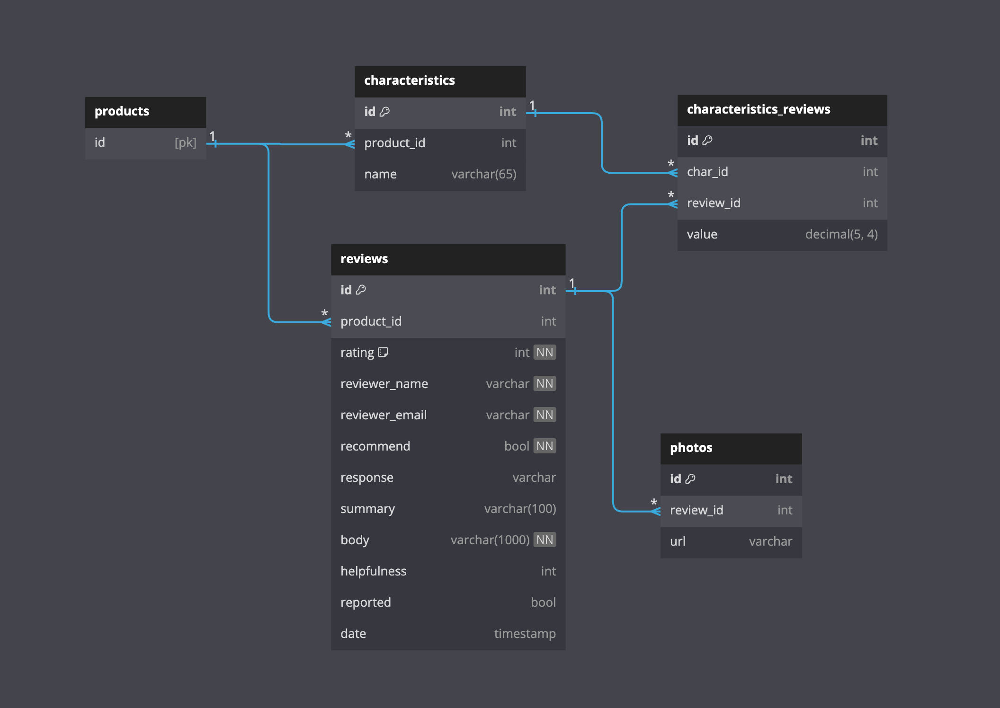

 
<h2 align="center">Project Atelier:
  Ratings & Reviews API </h3>

 

-   [About The Project](#about-the-project)
    -   [Built With](#built-with)
-   [API Development \& Optimization](#api-development--optimization)
-   [Deployment \& Testing](#deployment--testing)
-   [API Reference](#api-reference)
    -   [List Reviews](#list-reviews)
    -   [Get Review Metadata](#get-review-metadata)
    -   [Add a Review](#add-a-review)
    -   [Mark Review as Helpful](#mark-review-as-helpful)
    -   [Report Review](#report-review)
-   [Other Services](#other-services)

## About The Project

The goal of the project was to build a scalable RESTful API for an existing e-commerce web application and optimize it to withstand the web scale traffic loads. Working in a team of three engineers, we inherited a legacy codebase and each member took ownership of a micro service that will maintain the existing application data set. I was responsible for redesigning and building a backend server and database for the Q & A API service.

### Built With

  
  
  
  
  
  
  
   
  

## API Development & Optimization

    

-   Designed and evaluated RDBMS and DBMS and consider tradeoffs: selected PostgreSQL

-   Performed an ETL Process to transfer the existing data set (11M+) into PostgreSQL database

-   Optimize queries by implementing aggregate subqueries, and foreign key indexes

## Deployment & Testing

-   Decreased Stress Testing cycle length by using Loader.io to identify and revise bottlenecks
-   Set up NGINX load balancer with ip_hash method for horizontal scaling and reduce latency by 200%
-   Scale microservice to handle 1000 RPS by deploying 3 Node/Express servers and database on AWS EC2

## API Reference

#### List Reviews

Returns a list of reviews for a particular product. This list _does not_ include any reported reviews.
`GET /reviews/:product_id/list`

Parameters

| Parameter  | Type    | Description                                                                         |
| ---------- | ------- | ----------------------------------------------------------------------------------- |
| product_id | integer | Specifies the product for which to retrieve reviews.                                |
| page       | integer | Selects the page of results to return. Default 1.                                   |
| count      | integer | Specifies how many results per page to return. Default 5.                           |
| sort       | text    | Changes the sort order of reviews to be based on "newest", "helpful", or "relevant" |

Response `Status: 200 OK `

#### Get Review Metadata

Returns review metadata for a given product.

`GET /reviews/:product_id/meta`

Parameters

| Parameter  | Type    | Description                                                  |
| ---------- | ------- | ------------------------------------------------------------ |
| product_id | integer | Required ID of the product for which data should be returned |

Response `Status: 200 OK `

#### Add a Review

Adds a review for the given product.

`POST /reviews/:product_id`

Parameters

| Parameter  | Type    | Description                                       |
| ---------- | ------- | ------------------------------------------------- |
| product_id | integer | Required ID of the product to post the review for |

Body Parameters

| Parameter       | Type   | Description                                                                                                                               |
| --------------- | ------ | ----------------------------------------------------------------------------------------------------------------------------------------- |
| rating          | int    | Integer (1-5) indicating the review rating                                                                                                |
| summary         | text   | Summary text of the review                                                                                                                |
| body            | text   | Continued or full text of the review                                                                                                      |
| recommend       | bool   | Value indicating if the reviewer recommends the product                                                                                   |
| name            | text   | Username for question asker                                                                                                               |
| email           | text   | Email address for question asker                                                                                                          |
| photos          | [text] | Array of text urls that link to images to be shown                                                                                        |
| characteristics | object | Object of keys representing characteristic_id and values representing the review value for that characteristic. { "14": 5, "15": 5 //...} |

Response `Status: 201 CREATED `

#### Mark Review as Helpful

Updates a review to show it was found helpful.

`PUT /reviews/helpful/:review_id`

Parameters

| Parameter | Type    | Description                         |
| --------- | ------- | ----------------------------------- |
| review_id | integer | Required ID of the review to update |

Response `Status: 204 NO CONTENT `

#### Report Review

Updates a review to show it was reported. Note, this action does not delete the review, but the review will not be returned in the above GET request.

`PUT /reviews/report/:review_id`

Parameters

| Parameter | Type    | Description                         |
| --------- | ------- | ----------------------------------- |
| review_id | integer | Required ID of the review to update |

Response `Status: 204 NO CONTENT `

## Other Services

-   [Product Overview](https://github.com/labrador-retriever-SDC/atelier-products-backend) by [Rodrigo Gramitto](https://github.com/rodrigogramitto)
-   [Questions & Answers](https://github.com/labrador-retriever-SDC/atelier-questions-backend) by [Evan Pun](https://github.com/epun21403)
